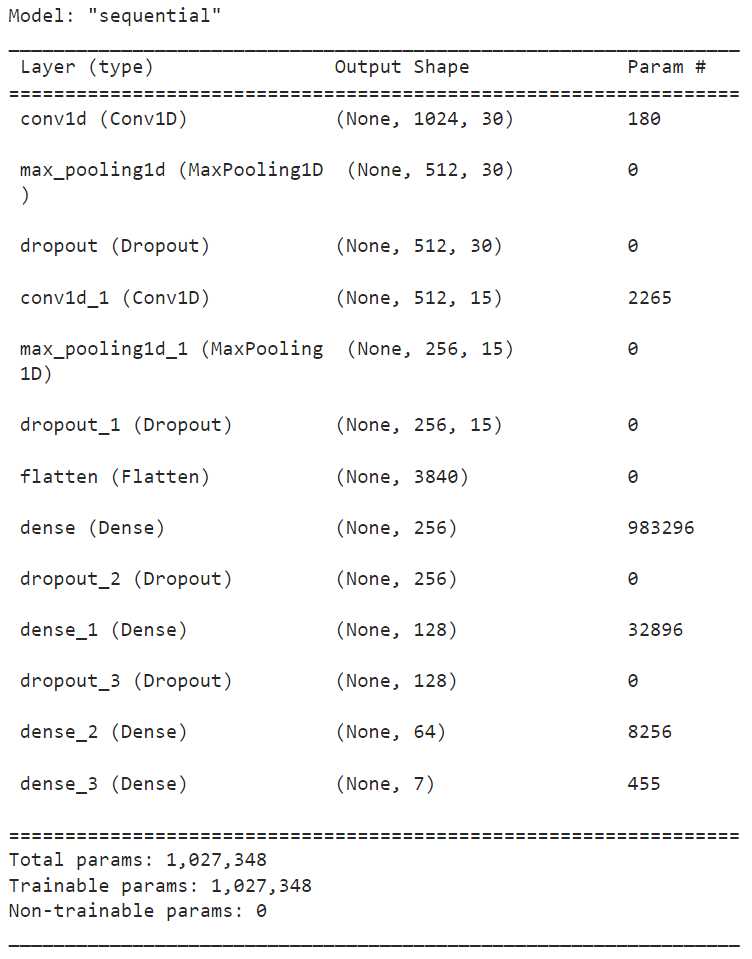
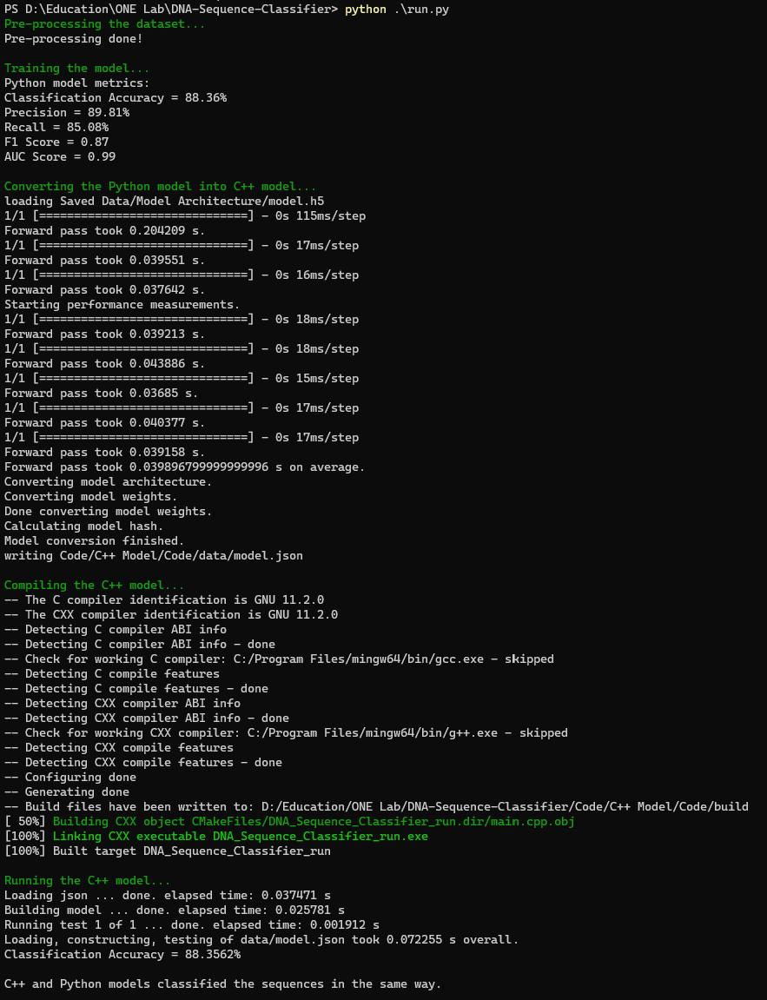

# DNA-Sequence-Classifier

## Introduction to the problem

Nowadays, machine learning is used for many applications which are fundamental researches in cheminformatics, bioinformatics, cosmology to quantitative social science, physics, agriculture, computer vision, gaming industry, linguistics etc. 

DNA sequence expresses many information about species which are behaviors, appearance, their parent’s information etc. Those information helps to identify a species separately form other species. Therefore, identifying the DNA Sequence order and their classification is significant need in today. Nowadays the Genetic expression is used frequently in medical sector. It applies to recognize the cancers, down syndrome, mutations, tumors. The goal of DNA sequencing is identifying the order of nucleotides (basic building block of nucleic acid (DNA & RNA)) of a given DNA section. Adenine (A), cytosine (C), guanine (G), and thymine (T) are the four nucleotides that makeup DNA (T). These are called the building blocks of DNA. The DNA of each virus is unique, and the pattern of arrangement of the nucleotides determines the unique characteristics of a virus.

## Dataset

The used dataset in this project can be found at:

https://www.kaggle.com/datasets/nageshsingh/dna-sequence-dataset?select=human.txt

The following figures shows the distribution of the dataset according to different classes.

  

 

  

## System Modules

### Pre-processing

Classification tasks are strongly based on the features that represent the objects to classify. In order to build a good representation it is necessary to recognize and measure important detail of the object, but in some cases it is quite difficult to understand which features use, and this affects the performances of the classification model. Recently neural deep learning architectures or deep learning models, were proved to be able to extract useful features from input patterns. These architecture are mainly applied to image processing and are capable to identify objects on natural images. 

The application of these techniques to DNA classification requires a fixed dimension representation of the sequences like the spectral representation based on k–mers occurrences. The spectral representation has been used in many bioinformatics works in order to obtain a fixed-size vector representation of DNA sequences. Given a fixed value k, a spectral representation is a vector of size 4k. Its components are computed by counting the occurrences of small DNA snippets of length k, called k–mers, which are extracted from the genomic sequences by means of a sliding window, with step = 1 and length = k. In case of k–mers containing one or more undefined nucleotides, for example the "N" character, they are discarded. The spectral representation adopts the so called "bag–of–words" model, which does not take into account the position of k–mers in the original sequence. This procedure is summarized in the following figure.

  

### Deep Learning Model

The used model is: LeNet5 network like Architecture CNN for Text Classification.

The model architecture is shown in the following figure.

  

## C++ Model

The second phase of the project is to synthesize the model through an FPGA by using HLS (high-level synthesis) methodology which requires C, C++, or SystemC source codes. For this reason, the illustrated modules is converted into C++ modules. The deep learning model is converted into C++ by using the `frugally-deep` package. The model is saved in <b>.h5</b> format and then converted into <b>.json</b> by using the sub-module `keras_export` provided by the `frugally-deep` package. Then the <b>.json</b> model is parsed into C++ object by using the same package as shown. 

`fdeep::model model = fdeep::load_model("data/model.json");`

Then this object is used to classify the test dataset items.

`auto result = model.predict({fdeep::tensor(fdeep::tensor_shape(static_cast<std::size_t>(dna_sequence.size()), 1), dna_sequence)});`

Where dna_sequence is one test set item represented as a vector after pre-processing.

## Automation Environment

The script `run.py` is used to run all the modules of the project including: dataset pre-processing, model training, model evaluation, model conversion to C++ model, compiling the C++ model, building the C++ model using CMake, running the C++ model, and making sure that the Python and C++ models classify the test dataset in the same way.

  

## Notes

The dataset is split by using `sklearn.model_selection.train_test_split` so the test set is not the same in every run of the model. The script `Saved Data/Test Set/save_test_set.py` is used to copy the test set used in Python model evaluation to the C++ project directory so that the two models are tested on the same subset of the dataset.

The model is evaluated many times on different test subsets and the metrics are averaged as shown in the following figure.

  

## References

<ol>
    <li>https://github.com/Dobiasd/frugally-deep</li>
    <li>https://www.researchgate.net/publication/305749061_A_Deep_Learning_Approach_to_DNA_Sequence_Classification</li>
    <li>https://bmcbioinformatics.biomedcentral.com/articles/10.1186/1471-2105-10-S14-S9</li>
</ol>

## Contributors 

